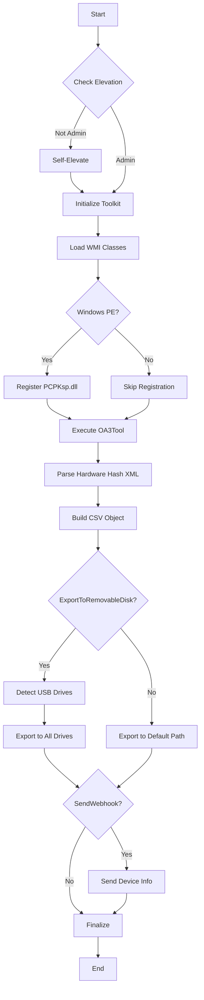

# Technical Documentation - Invoke-HardwareHashOperation

## Table of Contents

1. [Architecture Overview](#architecture-overview)
2. [Script Flow](#script-flow)
3. [Function Reference](#function-reference)
4. [Toolkit Infrastructure](#toolkit-infrastructure)
5. [Hardware Hash Extraction Process](#hardware-hash-extraction-process)
6. [CSV Format Specification](#csv-format-specification)
7. [Webhook Payload Structure](#webhook-payload-structure)
8. [Error Handling](#error-handling)
9. [Exit Codes](#exit-codes)
10. [Advanced Configuration](#advanced-configuration)

---

## Architecture Overview

### Component Hierarchy

```
Invoke-HardwareHashOperation.ps1 (Main Script)
    │
    ├─> Toolkit.ps1 (Core Infrastructure)
    │   │
    │   ├─> Functions/
    │   │   ├─> Invoke-Webhook.ps1
    │   │   └─> Start-ProcessWithOutput.ps1
    │   │
    │   ├─> Modules/ (Optional PowerShell modules)
    │   │
    │   └─> Tools/
    │       ├─> X64/OA3Tool.exe
    │       ├─> X64/PCPKsp.dll
    │       └─> X64/OA3.cfg
    │
    └─> Invoke-HardwareHashOperation.exe (PSBootstrapper)
```

### Design Principles

1. **Modularity**: Core functionality separated into reusable functions
2. **Environment Awareness**: Automatic detection of WinPE, Task Sequence, and Full OS
3. **Logging First**: Comprehensive logging at every step
4. **Error Resilience**: Graceful error handling with ContinueOnError support
5. **Self-Contained**: All dependencies included in package

---

## Script Flow

### Execution Sequence



### Detailed Steps

#### 1. Elevation Check
```powershell
Function Test-ProcessElevationStatus {
    $Identity = [System.Security.Principal.WindowsIdentity]::GetCurrent()
    $Principal = New-Object -TypeName 'System.Security.Principal.WindowsPrincipal' -ArgumentList ($Identity)
    $Result = $Principal.IsInRole([System.Security.Principal.WindowsBuiltInRole]::Administrator)
    Write-Output -InputObject ($Result)
}
```

#### 2. Toolkit Initialization
- Loads `Toolkit.ps1` via dot-sourcing
- Initializes logging infrastructure
- Loads WMI/CIM classes
- Imports functions and modules
- Sets up error handling

#### 3. Hardware Hash Extraction
- Registers PCPKsp.dll (WinPE only)
- Executes OA3Tool.exe with configuration
- Parses XML output
- Extracts hardware hash value

#### 4. CSV Export
- Builds Autopilot-compatible CSV structure
- Exports to specified path(s)
- Optionally exports to removable drives

#### 5. Webhook Transmission (Optional)
- Gathers device information
- Formats JSON payload
- Sends HTTP POST request
- Logs response

---

## Function Reference

### Invoke-WebhookRequest

**Purpose**: Send HTTP webhook requests with device information

**Syntax**:
```powershell
Invoke-WebhookRequest
    -WebhookURI <URI>
    [-WebhookHeaders <OrderedDictionary>]
    [-WebhookMethod <WebRequestMethod>]
    [-WebhookBody <OrderedDictionary>]
    [-IncludeDefaultWebhookBody]
    [-WebhookContentType <String>]
    [-OutputRawResponse]
    [-ContinueOnError]
```

**Parameters**:

| Parameter | Type | Description |
|-----------|------|-------------|
| WebhookURI | URI | Target endpoint URL |
| WebhookHeaders | OrderedDictionary | Custom HTTP headers |
| WebhookMethod | WebRequestMethod | HTTP method (default: POST) |
| WebhookBody | OrderedDictionary | Custom payload |
| IncludeDefaultWebhookBody | Switch | Auto-gather device info |
| WebhookContentType | String | Content-Type header (default: application/json) |
| OutputRawResponse | Switch | Return raw response object |
| ContinueOnError | Switch | Suppress errors |

**Return Object**:
```powershell
# When OutputRawResponse is False (default)
[PSCustomObject]@{
    # Parsed JSON response content
}

# When OutputRawResponse is True
[Microsoft.PowerShell.Commands.WebResponseObject]@{
    StatusCode
    StatusDescription
    Content
    Headers
    # ... additional properties
}
```

**Device Information Payload** (when IncludeDefaultWebhookBody is used):
```json
{
  "OperatingSystemDetails": {
    "ComputerName": "DESKTOP-ABC123",
    "Caption": "Windows 11 Pro",
    "Architecture": "X64",
    "Version": "10.0.22621.1234",
    "ReleaseID": "22H2",
    "ProductType": 1,
    "SKU": 48,
    "Language": "en-US",
    "Timezone": {
      "Name": "Pacific Standard Time",
      "Caption": "(UTC-08:00) Pacific Time (US & Canada)"
    }
  },
  "HardwareDetails": {
    "Manufacturer": "Dell Inc.",
    "Model": "Latitude 7420",
    "SerialNumber": "ABC123XYZ",
    "BIOSVersion": "1.15.0",
    "UUID": "4C4C4544-0050-5810-8052-B2C04F563432",
    "BaseboardManufacturer": "Dell Inc.",
    "BaseboardProduct": "0K0T6T",
    "BaseboardVersion": "A00",
    "ChassisTypes": [10],
    "SKU": "0A12",
    "UEFISecureBootStatus": "Enabled",
    "CPU": {
      "Model": "11th Gen Intel(R) Core(TM) i7-1185G7 @ 3.00GHz",
      "MaximumClockSpeedInGHz": 3.0,
      "PhysicalCores": 4,
      "LogicalCores": 8
    },
    "MemoryInGB": 16.0
  }
}
```

---

### Start-ProcessWithOutput

**Purpose**: Execute external processes with comprehensive output capture

**Syntax**:
```powershell
Start-ProcessWithOutput
    -FilePath <String>
    [-WorkingDirectory <DirectoryInfo>]
    [-ArgumentList <String[]>]
    [-AcceptableExitCodeList <String[]>]
    [-WindowStyle <String>]
    [-CreateNoWindow]
    [-NoWait]
    [-Priority <String>]
    [-ExecutionTimeout <TimeSpan>]
    [-ExecutionTimeoutInterval <TimeSpan>]
    [-StandardInputObjectList <Object[]>]
    [-ParsingExpression <Regex>]
    [-SecureArgumentList]
    [-LogOutput]
    [-ContinueOnError]
```

**Return Object**:
```powershell
[PSCustomObject]@{
    ExitCode = 0
    ExitCodeAsHex = "0x00000000"
    ExitCodeAsInteger = 0
    ExitCodeAsDecimal = "0"
    ProcessObject = [System.Diagnostics.Process]
    StandardOutput = "Command output text..."
    StandardOutputObject = [System.Text.RegularExpressions.MatchCollection] # If ParsingExpression used
    StandardError = "Error output text..."
    StandardErrorObject = [System.Text.RegularExpressions.MatchCollection] # If ParsingExpression used
}
```

**Usage in Main Script**:

```powershell
# Register PCPKsp.dll in WinPE
$StartProcessWithOutputParameters = @{
    FilePath = 'rundll32.exe'
    ArgumentList = @("`"$($PCPKSPPath.FullName)`",DllInstall")
    AcceptableExitCodeList = @('0')
    CreateNoWindow = $True
    ExecutionTimeout = [System.Timespan]::FromSeconds(30)
    ExecutionTimeoutInterval = [System.Timespan]::FromSeconds(5)
    LogOutput = $True
    ContinueOnError = $False
    Verbose = $True
}
$Result = Start-ProcessWithOutput @StartProcessWithOutputParameters

# Execute OA3Tool
$StartProcessWithOutputParameters = @{
    FilePath = $OA3ToolPath.FullName
    WorkingDirectory = [System.IO.Path]::Combine($ContentDirectory.FullName, 'OA3Results')
    ArgumentList = @("/Report", "/ConfigFile=`"$($OA3CFGPath.FullName)`"", "/NoKeyCheck")
    AcceptableExitCodeList = @('0')
    CreateNoWindow = $True
    ExecutionTimeout = [System.Timespan]::FromSeconds(30)
    ExecutionTimeoutInterval = [System.Timespan]::FromSeconds(5)
    LogOutput = $True
    ContinueOnError = $False
    Verbose = $True
}
$Result = Start-ProcessWithOutput @StartProcessWithOutputParameters
```

---

## Toolkit Infrastructure

### Toolkit.ps1 Core Components

#### 1. Error Handling Definition
```powershell
[ScriptBlock]$ErrorHandlingDefinition = {
    Param(
        [System.Management.Automation.ErrorRecord]$ErrorRecord,
        [Int16]$Severity,
        [Boolean]$ContinueOnError
    )
    # Logs error details and optionally throws
}
```

#### 2. Logging ScriptBlock
```powershell
[ScriptBlock]$WriteLogMessage = {
    Param(
        [Int16]$Severity,  # 0=Info, 1=Verbose, 2=Warning, 3=Error
        [String[]]$LogMessageEntryList
    )
    # Writes formatted log messages
}
```

#### 3. Initialization Actions
```powershell
[ScriptBlock]$InitializationActions = {
    # Starts transcript
    # Logs script details
    # Logs parameters
    # Loads functions and modules
}
```

#### 4. Finalization Actions
```powershell
[ScriptBlock]$FinalizationActions = {
    # Logs execution time
    # Stops transcript
    # Reports exit code
}
```

### Pre-Loaded Variables

| Variable | Type | Description |
|----------|------|-------------|
| `$Bios` | CimInstance | Win32_Bios WMI class |
| `$ComputerSystem` | CimInstance | Win32_ComputerSystem WMI class |
| `$OperatingSystem` | CimInstance | Win32_OperatingSystem WMI class |
| `$MSSystemInformation` | CimInstance | MS_SystemInformation WMI class |
| `$Baseboard` | CimInstance | Win32_Baseboard WMI class |
| `$IsWindowsPE` | Boolean | True if running in Windows PE |
| `$OSArchitecture` | String | "X64" or "X86" |
| `$ContentDirectory` | DirectoryInfo | Content folder path |
| `$ToolsDirectory_OSArchSpecific` | DirectoryInfo | Architecture-specific tools path |
| `$LogDirectory` | DirectoryInfo | Log file directory |
| `$TextEncoder` | Encoding | Default text encoding |

---

## Hardware Hash Extraction Process

### OA3Tool Configuration

**File**: `Toolkit\Tools\X64\OA3.cfg`

```xml
<?xml version="1.0" encoding="utf-8"?>
<OA3ToolConfig>
  <ReportMode>true</ReportMode>
  <NoKeyCheck>true</NoKeyCheck>
  <OutputFormat>XML</OutputFormat>
</OA3ToolConfig>
```

### Execution Steps

1. **Clean Previous Results**
   ```powershell
   $ExistingHardwareHashXMLList = Get-ChildItem -Path $WorkingDirectory -Filter '*.xml' -Recurse -Force
   ForEach ($XML In $ExistingHardwareHashXMLList) {
       [System.IO.File]::Delete($XML.FullName)
   }
   ```

2. **Execute OA3Tool**
   ```powershell
   $OA3ToolExecutionResult = Start-ProcessWithOutput @StartProcessWithOutputParameters
   ```

3. **Parse XML Output**
   ```powershell
   $OA3XMLContent = [System.IO.File]::ReadAllText($OA3XMLPath.FullName, $TextEncoder)
   $OA3XMLDocument = New-Object -TypeName 'System.XML.XMLDocument'
   $OA3XMLDocument.LoadXml($OA3XMLContent)
   $HardwareHashNode = $OA3XMLDocument.SelectSingleNode('/Key/HardwareHash')
   $HardwareHash = $HardwareHashNode.'#text'
   ```

4. **Validate Hash**
   ```powershell
   $HardwareHashExists = ([String]::IsNullOrEmpty($HardwareHash) -eq $False) -and 
                         ([String]::IsNullOrWhiteSpace($HardwareHash) -eq $False)
   ```

---

## CSV Format Specification

### Autopilot CSV Structure

```csv
Device Serial Number,Windows Product ID,Hardware Hash,Group Tag,Assigned User
ABC123XYZ,,AAAAAQAAA...base64hash...AAAA==,,
```

### Field Descriptions

| Field | Required | Description | Example |
|-------|----------|-------------|---------|
| Device Serial Number | Yes | BIOS serial number | "ABC123XYZ" |
| Windows Product ID | No | Windows product ID | "" (typically empty) |
| Hardware Hash | Yes | Base64-encoded hardware hash | "AAAAAQAAA..." |
| Group Tag | No | Autopilot group tag | "" (can be populated later) |
| Assigned User | No | Pre-assigned user UPN | "" (can be populated later) |

### CSV Generation Code

```powershell
$HardwareHashObjectProperties = [Ordered]@{
    'Device Serial Number' = $Bios.SerialNumber
    'Windows Product ID' = ''
    'Hardware Hash' = $HardwareHash
    'Group Tag' = ''
    'Assigned User' = ''
}

$HardwareHashObject = New-Object -TypeName 'PSObject' -Property $HardwareHashObjectProperties
$HardwareHashCSVObject = $HardwareHashObject | ConvertTo-CSV -Delimiter ',' -NoTypeInformation
$HardwareHashCSVContent = $HardwareHashCSVObject -ireplace '(\")', '' | Out-String
```

---

## Webhook Payload Structure

See [Function Reference - Invoke-WebhookRequest](#invoke-webhookrequest) for complete payload structure.

---

## Error Handling

### Error Categories

| Severity | Level | Description | Action |
|----------|-------|-------------|--------|
| 0 | Info | Informational message | Log only |
| 1 | Verbose | Detailed information | Log only |
| 2 | Warning | Non-critical issue | Log and continue |
| 3 | Error | Critical failure | Log and throw (unless ContinueOnError) |

### Error Handling Pattern

```powershell
Try {
    # Operation
}
Catch {
    $ErrorHandlingDefinition.Invoke($Error[0], 2, $ContinueOnError.IsPresent)
}
Finally {
    # Cleanup
}
```

---

## Exit Codes

### Exit Code Ranges

| Range | Category | Description |
|-------|----------|-------------|
| 0-999 | Success | Operation completed successfully |
| 1000-1999 | Warning | Completed with warnings |
| 2000-2999 | Error | Operation failed |
| 6000 | Toolkit Error | Toolkit initialization failed |

### Common Exit Codes

| Code | Meaning |
|------|---------|
| 0 | Success |
| 6000 | Toolkit failed to load |
| 2000+ | Error occurred (check logs) |

---

## Advanced Configuration

### Custom Log Directory

```powershell
.\Invoke-HardwareHashOperation.ps1 -LogDirectory "C:\CustomLogs\Autopilot"
```

### Custom Export Path with Overwrite

```powershell
.\Invoke-HardwareHashOperation.ps1 `
    -ExportPath "\\Server\Share\Autopilot\Hashes\$($env:COMPUTERNAME).csv" `
    -Overwrite
```

### Webhook with Custom Headers

```powershell
$Headers = @{
    "Authorization" = "Bearer $($env:API_TOKEN)"
    "X-Client-ID" = "AutopilotCollector"
    "X-Environment" = "Production"
}

.\Invoke-HardwareHashOperation.ps1 `
    -SendWebhook `
    -WebhookURI "https://api.company.com/autopilot/register" `
    -WebhookHeaders $Headers `
    -ContinueOnError
```

---

**Document Version**: 1.0  
**Last Updated**: 2025  
**Maintained By**: IT Operations Team

